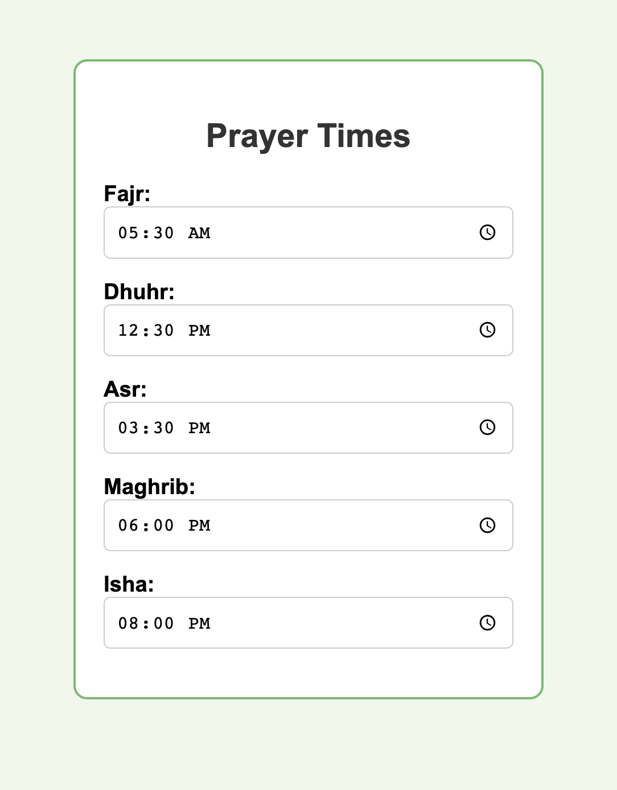

# Customizable Muslim Prayer Time Widget



This is a simple customizable Muslim prayer time widget built with HTML, CSS, and JavaScript. It allows users to set their own prayer times according to their needs.

## Features

- Input fields for Fajr, Dhuhr, Asr, Maghrib, and Isha prayer times.
- Users can customize the prayer times according to their local timings.
- Saved prayer times persist even after page refresh using browser's localStorage.

## Demo

You can see a live demo [here](https://abdulmuspik.github.io/Prayer-Time-Widget/).

## Usage

1. Clone the repository:

```bash
git clone https://github.com/AbdulMuspik/Prayer-Time-Widget.git
```

2. Open `index.html` in your web browser.

3. Set your desired prayer times in the input fields.

4. Your changes will be automatically saved and persisted.

## Customization

You can customize the appearance and behavior of the widget by modifying the following files:

- `styles.css`: For styling the widget.
- `script.js`: For changing the behavior of the widget.

## Contributing

Contributions are welcome! Feel free to open issues and pull requests.

1. Fork the repository.
2. Create your feature branch (`git checkout -b feature/my-feature`).
3. Commit your changes (`git commit -am 'Add my feature'`).
4. Push to the branch (`git push origin feature/my-feature`).
5. Open a pull request.
